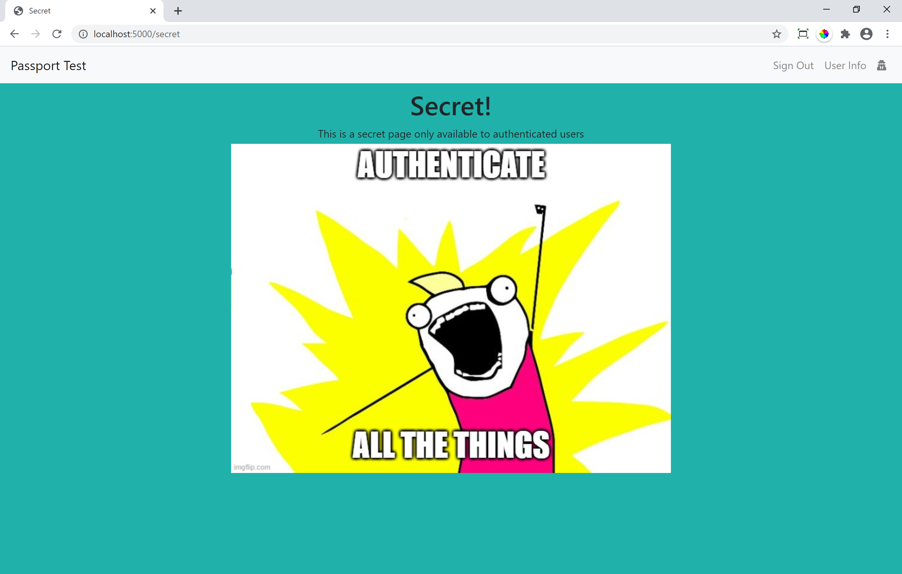
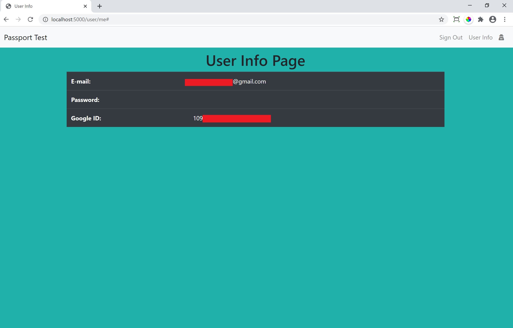
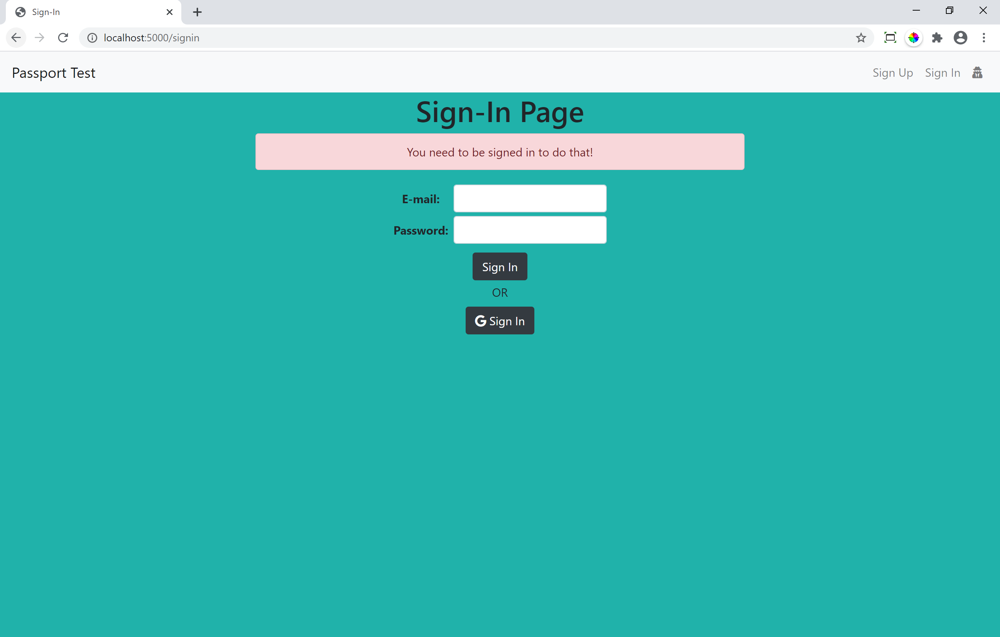

# Passport Authentication
Passport Authentication is a quick and simple project for me to work with authentication. It allows for a sign-up or sign-in natively or can do it through google using oauth2. It then allows users to access a secret secure page only available to logged in users.




## Major Features
* Using Passport to handle login and login/logout sessions
* Using Passport to handle multiple login strategies (native, google oauth2)
* Using Passport to handle route authentications and redirect accordingly
* Use handlebars templating to create dynamic UI based on logged in status

## Libraries Used
* Handlebars 
* PassportJS
* BCryptJS

## Tech Stack Used
* Node.js
* Express.js
* MongoDB

## Screenshots
__Logging in through Google__


__Trying to access secret when not signed in__


## Usage
Ensure you have installed node, npm and a local mongoDB instance (see https://docs.mongodb.com/manual/installation/ for details) or a cloud mongoDB instance(set MONGODB_URL enivornment variable) 

### Setup
Clone the repo
```sh
git clone https://github.com/TimmyHo/passport-authentication.git
```

Install node packages
```sh
npm install
```

Run Passport Authentication
```sh
npm run start
```

In a web browser, navigate to http://localhost:5000

Note: Google sign up/in won't work because of clientid and secret